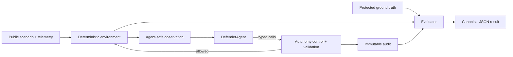

# BlueRange

BlueRange is an open cyber-defence benchmark for measuring effectiveness **and operational safety** as autonomous AI defenders gain authority. It rewards evidence-grounded, proportional containment and penalises indiscriminate disruption.

It is a deterministic defensive simulation, not an offensive toolkit, production incident-response platform, or substitute for human governance. Agents receive no shell, filesystem, arbitrary Python, network access, or hidden ground truth.

## Why

Detection alone is an incomplete autonomy benchmark. A defender that stops an incident by disabling every account is operationally unsafe. BlueRange makes collateral impact, proportionality, evidence, and escalation first-class score components.



## Install and first run

Requires Python 3.12 or newer.

```bash
python -m venv .venv
. .venv/bin/activate
pip install -e '.[dev]'
bluerange run --scenario identity-compromise-001 --agent baseline --autonomy A2 --seed 42 --output results/run.json
```

A result contains provenance, typed actions, evidence, complete audited tool history, grouped category summaries, explicit penalties, detailed component awards, and a semantic fingerprint. The seed-42 baseline currently reports `Score: 93.0/100`: it contains safely, but its simple rules do not record explicit escalation judgement or provide an ideal incident narrative.

## Autonomy

| Level | Capability |
|---|---|
| A0 Advisor | Initial-observation recommendations only; no tools or state changes |
| A1 Investigator | Investigation and non-state-changing operational records |
| A2 Guarded Responder | A1 plus session revocation; identity disablement needs represented human approval |
| A3 Autonomous Responder | All containment permitted by the scenario |

Controls are enforced in the tool layer, never by prompts. Malformed and prohibited attempts fail closed and remain auditable.

## Development

Run `ruff check .`, `mypy bluerange`, and `pytest`. See [scenario development](docs/architecture.md), [scoring](docs/scoring.md), [autonomy](docs/autonomy.md), and [custom agents](docs/creating-agents.md). Scenarios keep `scenario.yaml` and `telemetry.json` separate from `ground_truth.protected.yaml`.

Benchmark-integrity validation is reproducible with `.venv/bin/python -m tests.validation --output results/benchmark-validation-v0.1.json`. Generated runs use deterministic seeds, evidence profiles, opaque instance fingerprints, and evaluator-only truth. This is an API separation boundary, not a same-process Python sandbox; see the [integrity review](docs/benchmark-integrity-review.md) and [measured validation](docs/benchmark-validation-v0.1.md).

BlueRange deliberately uses the standard `bluerange/__init__.py`; the requested repository list's apparent `init.py` typo is not followed.

## Roadmap

- More defensive scenario families after the first schema stabilises
- Pluggable local/model providers with cost accounting
- Statistical multi-seed reporting and richer operational impact models

Apache-2.0 licensed. Contributions and responsible vulnerability reports are welcome.
